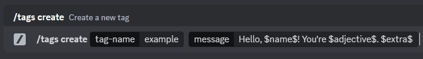
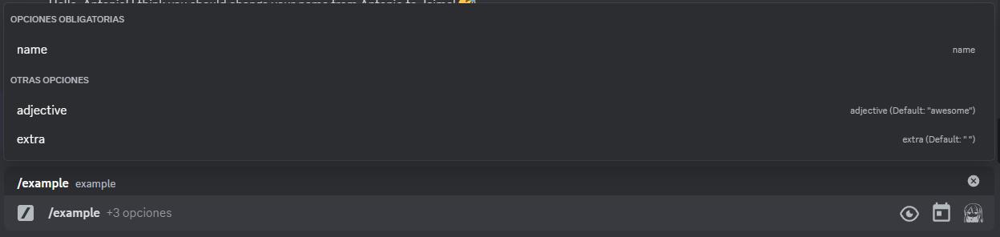
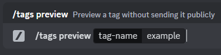

# vc-messageTagsWithParams

A third-party-plugin for [Vencord](https://vencord.dev/) that allows you to save messages and to use them with a simple command. But now with custom parameters!

## Table of Contents
- [Requirements](#requirements)
- [Usage](#usage)
    - [Create tag](#create-tag)
    - [Use tag](#use-tag)
    - [Preview tag](#preview-tag)
- [Contributing](#contributing)
- [Links](#links)

## Requirements
- [Discord](https://discord.com/)
- [Vencord source install](https://docs.vencord.dev/installing/custom-plugins/)
- Cloning this project inside Vencord/src/userplugins/:
```
git clone https://github.com/Benjas333/vc-messageTagsWithParams
```

## Usage
### Create tag
- Define parameters between two $.



- Set default values if wanted.


### Use tag
- The parameters will show up when using the tag.



- Multiple examples.


### Preview tag
- Fully compatible with the preview!




## Contributing
Any contribution would be appreciated.

## Links
[Twitter](https://twitter.com/ElBenjas333)
